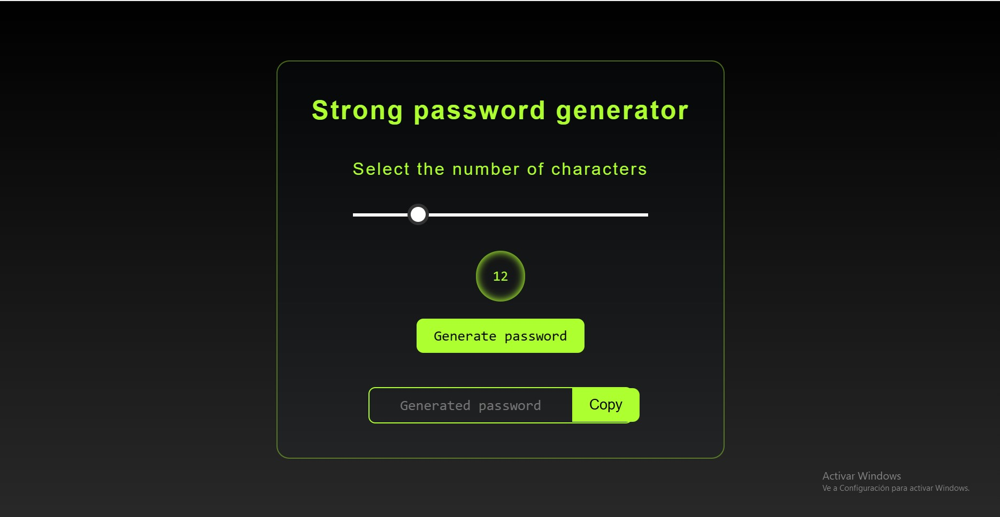
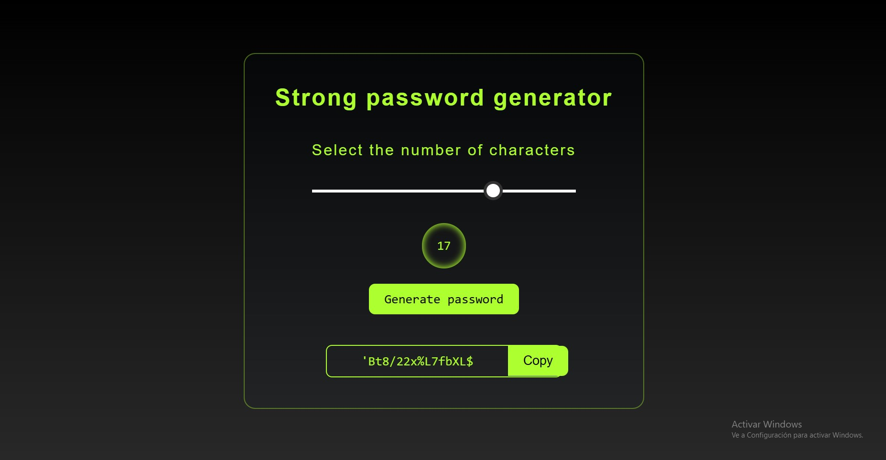

<h1>Password Generator</h1>

This repository contains a simple password generator developed with HTML, CSS, and JavaScript. This project allows you to quickly and easily generate secure passwords.

<h2>Features</h2>
<ul>
<li>Random password generation with customizable length.</li>
<li>Include: uppercase letters, lowercase letters, numbers, and special characters in the generated passwords.</li>
<li>Intuitive and user-friendly user interface.</li>
</ul>

<h2>Demo</h2>

You can try the password generator live <a href= "https://passwordgenerator.edeptec.com/" target ="_blank">here.</a>

<h2>Screenshots</h2>

<h2>Usage</h2>
<ol>
<li>Clone this repository to your local machine or download the ZIP file.</li>
<li>Open the index.html file in your web browser.</li>
<li>Customize the password length and generation options according to your needs.</li>
<li>Click the "Generate Password" button to get a secure password.</li>

</ol>

<h2>Customization</h2>

If you wish to make modifications to the password generator, you can edit the source code to suit your preferences:

<ul>
<li>index.html: Contains the HTML structure and user interface elements.</li>
<li>style.css: Contains the CSS styles for formatting the interface.</li>
<li>script.js: Contains the JavaScript logic for generating passwords and handling events.</li>
</ul>

<h2>Contributions</h2>

Contributions are welcome! If you have ideas for improving this password generator or come across any issues, please create a pull request or an issue report.

<h2>Credits</h2>

This password generator was developed by Esteban Carrillo.

I hope this password generator proves useful! If you have any questions or comments, feel free to open an issue or get in touch with us.

Thank you for using the Password Generator!

